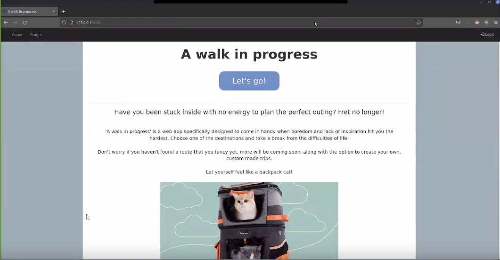
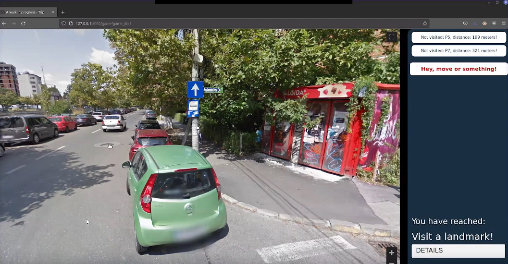

<div id="top"></div>

# A Walk In Progress

## About the project

A Walk In Progress is a web application designed to let its users roam locations
at their own pace, with the objective of visiting certain landmarks, using the
Google Maps Javascript API.

The goal of the project was to let users relive their experiences, plan their
future trips ahead of time and share them with others, and for educational
purposes, since the landmarks can be set to give users info about them once
they're reached.

<p align="right">(<a href="#top">back to top</a>)</p>

## Contributors

* Boiangiu Victor-Miron: Coded the application’s back-end and created the
  database.
* Limberea Gabriela: Worked on the app’s back-end and deployed the application
  with Docker.
* Stefan Mihaela: Made the application’s front-end and connected it with the
  back-end.

<p align="right">(<a href="#top">back to top</a>)</p>

## Built With

* HTML, Javascript, CSS
* [Bootstrap](https://getbootstrap.com/)
* [Flask](https://flask.palletsprojects.com)
* [Google Maps Javascript API](https://developers.google.com/maps/documentation/javascript/overview)
* [Docker](https://www.docker.com/)

<p align="right">(<a href="#top">back to top</a>)</p>

## Getting Started

### Pre-Requisites:

* [Docker](https://www.docker.com/)
* [Docker compose](https://docs.docker.com/compose/install/)
* [Python 3.8+](https://www.python.org/downloads/)
* [Direnv](https://direnv.net/)

<br>

### Passing your API key to the server

> Note: You can also leave the key value empty to run the API in development
> mode.

You need to have a .envrc file in the root of the project, which sets the
following environment variable:

```bash
export API_KEY=<your_api_key>
```

Also run "direnv allow ." in the root of the project.

Alternatively, you can also run the command in the terminal yourself before
building the image.

<br>

### How to run the server:

Using the Makefile in the root of the project, you can run the following:

* `make run` - Runs the application locally (you need to replace the API key
  manually in the Game.html file)
* `make docker-build` - Builds the docker image locally
* `make docker-up` - Starts the docker container with the remote image (or with
  the local image, if you have the API_KEY set)
* `make docker-down` - Stops the docker container
* `make docker-clean` - Removes the docker image

<p align="right">(<a href="#top">back to top</a>)</p>

## Application Usage

Once the server is run, users can create an account and choose any of the
current available trips to go on.

Once in a trip, the user is free to roam around the location and can hit all
checkpoints in the order he wishes to.

As soon as all checkpoints are hit, the user can end the trip and choose another
one. The trip is marked as finished in the user's profile.

<details>
  <summary>Example of user usage</summary>

An unlogged user visits the website.


He creates an account if he doesn't already have one.


He now logs in.


He is now logged in and can access his profile and trips.


His profile shows no finished trips.


He chooses a trip from the available ones.


He is put into Maps' street view mode and can now roam the map.


The distance to waypoints can be seen next to their names.


Once he reaches a waypoint, it's marked as visited (colored green).


The user can press "Details" after visiting a waypoint, to see details about it.


The trip is now marked as finished in the user's profile.

</details>

<p align="right">(<a href="#top">back to top</a>)</p>

## Difficulties encountered

We had difficulties understanding the Google Maps API documentation, as well as
using the free option of the API, in order to be able to put the project on
GitHub we had to scrap the API key we used, which we forgot to do at first.

<p align="right">(<a href="#top">back to top</a>)</p>

## Roadmap:

* User account creation (DONE)
* Users can go on trips (DONE)
* Trips can end and have custom information (DONE)

<br>

* Allow users custom trip creation (ETA: To be determined)

<p align="right">(<a href="#top">back to top</a>)</p>

## License

Distributed under the MIT License. See `LICENSE.txt` for more information.

<p align="right">(<a href="#top">back to top</a>)</p>
